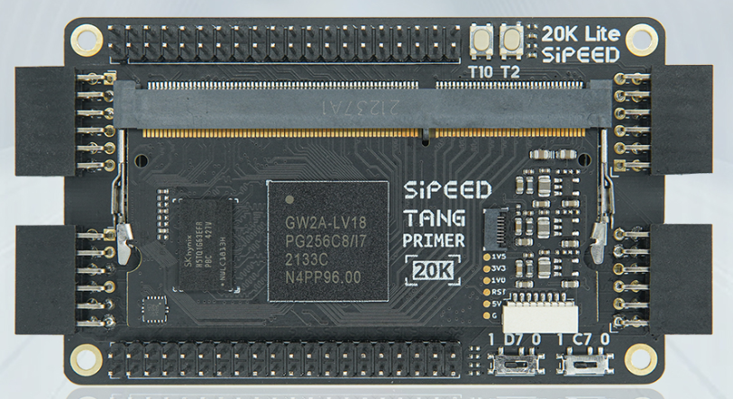
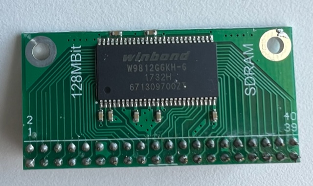

## Open Source SDRAM controller for Tang Primer 20K

<table cellspacing=0 cellpadding=0" style="border: none;"><tr><td></td> <td valign='center'>+</td> <td></td></tr></table>

This is a simple low-latency, word-based and non-bursting controller for SDRAM modules on the [Tang Primer 20k](https://www.aliexpress.com/item/1005004653308809.html) FPGA board. The SDRAM chip tested is [Winbond W9812G6KH-6](https://www.winbond.com/resource-files/da00-w9812g6khc1.pdf) (2M x 4 banks x 16 bits), in total 128 Mbits.

Under default settings (max 66.7Mhz):
- Latency for every data read is 4 cycles. 
- Read/write operations take 5 cycles to complete. There's no overlap between reads/writes.
- Max bandwidth is therefore 26.7 MB/s (66.7/5*2).
- All reads/writes are done with auto-precharge. So the user does not need to deal with row activations and precharges.
- SDRAMs need periodic refreshes or data loss happens. They provide an *auto-refresh* function to do one row of refresh. This auto-refresh operation is controlled with the `refresh` input pin. 4096 or more refreshes should happen in any 64ms for the memory to not lose data. So the main circuit should invoke auto-refresh at least once **every ~15us**.

SDRAM Wiring:
- See [sdram_top.v](src/sdram_top.v) for a wiring diagram. You need about 40 wires for sdram to work.
- 12 address pins: row address A[11:0] (4096 rows), column address A[8:0] (512 words per row)
- 2 bank address pins.
- 16 DQ pins.
- CLK, CKE, nCS, nRAS, nCAS, nWE
- VCC and GND.
- Tie DQM pins to ground if your module have them.
- Finally we need a 180-degree phase-shifted clock signal (`clk_sdram`) for SDRAM. This can be generated with PLL's clkoutp output.

Usage:
- [sdram.v](src/sdram.v) is the actual SDRAM controller.
- See [sdram_top.v](src/sdram_top.v) for an example where all 16MB of memory is written to and read from. [Results](doc/test_results.png) are printed to the serial console.

Feng Zhou, 2022.9

